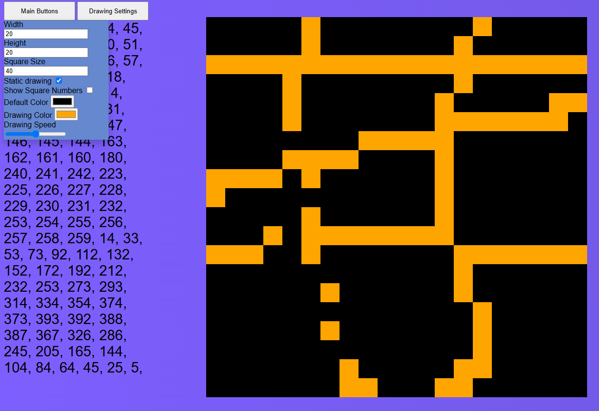

# Description

This is a fun little game thing where there is a grid of html squares and you can change their color by moving your mouse across them.
This lets you kinda draw images.

[TRY IT HERE](https://joipoi.github.io/games/grid-drawing/index.html)

# Install/Use
Clone or download the repo, then simply open the index.html file in your browser

# Features
- Change square size and square amount in grid
- Have the drawing disappear or stay
- show or hide square index numbers
- Change square colors
- Change square disappearance speed
- Remember what has been drawn and re-draw it
- reset draw memory or reset grid

# Potential improvements
- Some half finished features were commented out and could be added again
- Have a list of premade drawings that could be chosen by the user
- Figure out how to draw numbers/letters so we can write things out
- Several small design improvements can be made
